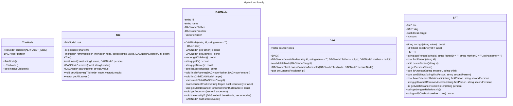

# Classes Diagram

```mermaid
---
title: Mysterious Family
---
classDiagram
    class TrieNode {
        -TrieNode* children[ALPHABET_SIZE]
        -DAGNode* person
        +TrieNode()
        +~TrieNode()
        +bool hasNoChildren()
    }
    class Trie {
        -TrieNode* root
        -int getIndex(char chr)
        -TrieNode* removeHelper(TrieNode* node, const string& value, DAGNode*& person, int depth)
        +Trie()
        +void insert(const string& value, DAGNode* person)
        +DAGNode* remove(const string& value)
        +DAGNode* search(const string& value)
        +void getAllLeaves(TrieNode* node, vector<DAGNode*>& result)
        +vector<DAGNode*> getAllLeaves()
    }
    class DAGNode {
        -string id
        -string name
        -DAGNode* father
        -DAGNode* mother
        +vector<DAGNode*> children
        +DAGNode(string id, string name = "")
        +~DAGNode()
        +DAGNode* getFather() const
        +DAGNode* getMother() const
        +vector<DAGNode*> getChildren() const
        +string getID() const
        +string getName() const
        +bool isSourceNode() const
        +void linkToParents(DAGNode* father, DAGNode* mother)
        +void linkChild(DAGNode* target)
        +void unlinkChild(DAGNode* target)
        +bool searchInChildren(string target, bool recursively = false)
        +void getMostDistanceFromChildren(int& distance) const
        +void getAncestors(vector<DAGNode*>& ancestors)
        +void traverseUpTo(DAGNode*& breakNode, vector<DAGNode*> nodes)
        +DAGNode* findFarthestNode()
    }
    class DAG {
        -vector<DAGNode*> sourceNodes
        +DAG()
        +DAGNode* createNode(string id, string name = "", DAGNode* father = nullptr, DAGNode* mother = nullptr)
        +void deleteNode(DAGNode* target)
        +DAGNode* findLowestCommonAncesotor(DAGNode* firstNode, DAGNode* secondNode)
        +pair<DAGNode*, DAGNode*> getLongestRelationship()
    }
    class SFT {
        -Trie* trie
        -DAG* dag
        -bool doesEncrypt
        -int count
        -string encrypt(string value) const
        +SFT(bool doesEncrypt = false)
        +~SFT()
        +string addPerson(string id, string fatherID = "", string motherID = "", string name = "")
        +bool findPerson(string id)
        +void deletePerson(string id)
        +int getPersonsCount()
        +bool isAncestor(string ancestor, string child)
        +bool areSiblings(string firstPerson, string secondPerson)
        +bool haveExtendedRelationship(string firstPerson, string secondPerson)
        +string getLowsetCommonAncestor(string firstPerson, string secondPerson)
        +int getMostDistanceFromChildren(string person)
        +pair<string, string> getLongestRelationship()
        +string toJSON(bool oneline = true) const
}
```